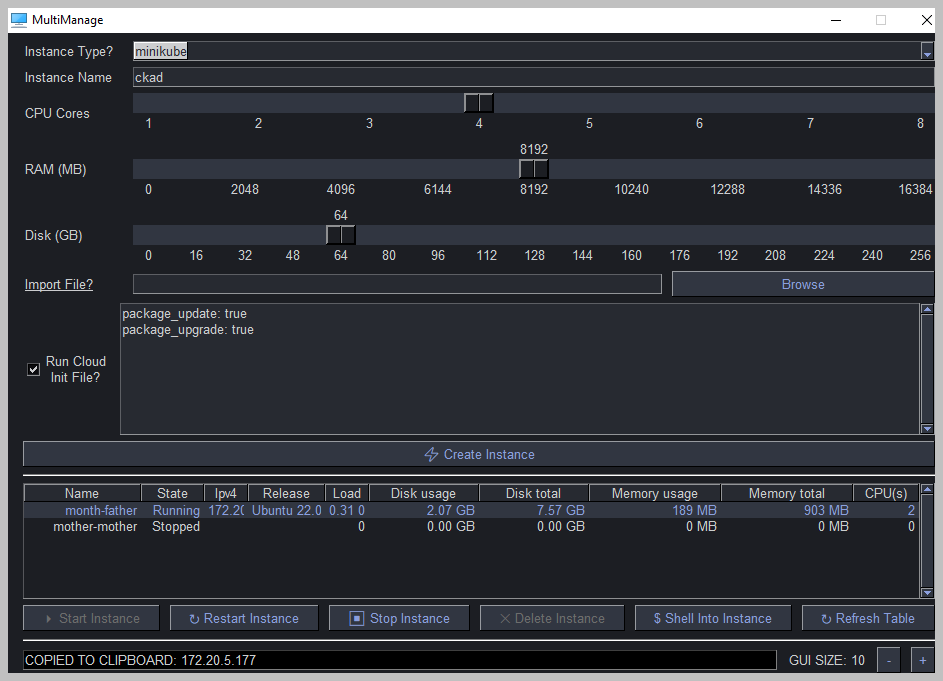

# MultiManage

A multi-platform GUI to manage Canonical [Multipass](https://multipass.run). Built using Python and the fantastic [PySimpleGUI](https://www.pysimplegui.org/).

## Installation 
Installers are available on the [release](https://github.com/rootisgod/MultiManage/releases) page

| OS      	| Type                  	| Name                      	|
|---------	|-----------------------	|---------------------------	|
| Windows 	| Installer             	| Installer-multimanage.exe 	|
| Windows 	| Standalone Executable 	| multimanage.exe           	|
| Mac     	| Standalone Executable 	| Mac-multimanage.zip       	|
| Linux   	| Standalone Executable 	| Linux-multimanage.zip     	|

NOTE: Windows will complain that the software could be dangerous. Use your own judgement, but each build goes through Github actions which you can check yourself. I give no warranty etc etc so use at your own risk regardless.

But, please use, hopefully somebody finds it useful!

## Documentation

### Goals

This GUI is intended to try and make managing your instances that bit easier. Experience with the command line multipass utility is helpful, but not required.

The major goals were;
 - Cross platform
 - Simple install
 - Allow use of cloud init templates at deploy time
 - Simple access to create/shell into/delete instances
 
The system should be quite intuitive. You can either create an instance by;
 - Provide a name (if no name is supplied one will be generated for you)
 - An image type
 - CPU/RAM/DISK Requirements
 - Pass a cloud-init script to optionally run it. An apt update/upgrade is provided as little quality of life feature
 - Then hit 'Create Instance'. It will appear in the table below

Or, manage existing instances
 - Start/Stop/Delete
 - Shell into selected instance

### Tips and Tricks

There are a few nice features that are not immediately obvious

 - Click a cell in the instances info to have that data copied to the clipboard (like the IP address of the instance)
 - Click the 'Import File?' text to go to the Cloud-Init examples page
 - If you make a change to the multipass system outside of the GUI, click 'Refresh Table' to update the instance info
 - Make the window bigger or smaller with the + and - options at the bottom

### Gotchas

It's not perfect. 

 - My code is probbaly horrendous. I write powershell scripts on ocassion and im sure this code is not pythonic or all that thought out. It's just me solving my own problem.
 - Please be careful when deleting stopped instances. You will be given a chance to purge the instance to reclaim disk space, but the command is GLOBAL. All 'deleted' instances will become purged and irrecoverable.
 - Unexpected errors likely just crash the program...
 - Creating a new instance is the most time-consuming part, if it hangs excessivelt without feedback assume something is actually happening, but give it time.
 - If it crashes, it may be because a column value changed during initialization or such like. Sorry, just reload
 - I don't check the multipass version, just that the 'multipass version' command returns a string I search for. Can try improve later. The minimum Multipass version isn't a joke as the columns required chaged in version 1.11.1
 - It gets quite wide when you have a started instance, sorry, not sure what I can do other than make the window dimensions resizable
 - The window dimensions are not manually resizable
 - A new Multipass release could break it

### TODO

There are still a few useful features to add. No promises on any of these though! Feel free to PR me though. The build guide is in the Documents folder.

 - Allow mounting of a local folder to the instance
 - Allow resizing of existing instances
 - Allow the user to choose the network the instance uses
 - Maybe some predefined cloud init templates/software features to choose (docker, snapd etc...)
 - Transfer file dialog window to simplify
